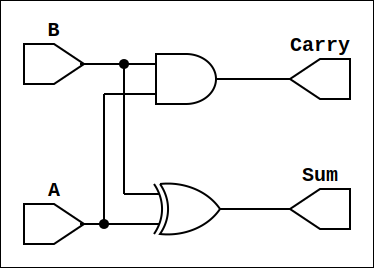

## Introduction

[Yosys](https://github.com/YosysHQ/yosys) and [Verilator](https://github.com/verilator) are two powerful free and open source tools that will help us automate verification, testing, simulation, and synthesis in our circuit designs. In this post, we will be implementing a half adder.

## Half Adder

Truth table for a half adders is as follows:

| A | B | Sum | Carry |
|:-:|:-:|:---:|:-----:|
| 0 | 0 |  0  |   0   |
| 0 | 1 |  1  |   0   |
| 1 | 0 |  1  |   0   |
| 1 | 1 |  0  |   1   |

Observe that

$$
\text{Sum} = A \oplus B \quad \text{Carry} = AB
$$

thus in order to have a half adder we will have the following verilog module

```verilog
/* modules/halfadder.v */

module halfadder(
		 input	A,
		 input	B,
		 output	Sum,
		 output	Carry);
   assign Sum = A ^ B;
   assign Carry = A && B;
endmodule
```

Now that we have a half adder, we need a simple test case to use with Verilator. Following test case we be enough for our neeeds

```cpp
/* simulations/sim_vhalfadder.cpp */

#include "Vhalfadder.h"
#include "verilated_vcd_c.h"

int main(int argc, char** argv) {
  Verilated::commandArgs(argc, argv);
  Verilated::traceEverOn(true);

  std::unique_ptr<Vhalfadder> halfadder = std::make_unique<Vhalfadder>();
  std::unique_ptr<VerilatedVcdC> m_trace = std::make_unique<VerilatedVcdC>();
  halfadder->trace(m_trace.get(), 5);
  m_trace->open("halfadder_waveform.vcd");

  for(int i = 0; i < 1 << 2; i++) {
    halfadder->A = (0b10 & i) >> 1;
    halfadder->B = (0b1 & i) >> 0;
    halfadder->eval();
    m_trace->dump(i);
  }

  m_trace->close();
  return 0;
}
```

we will use cmake to verilate out verilog modules an example `CMakeLists.txt` can be as following

```cmake
# CMakeLists.txt

cmake_minimum_required(VERSION 3.25)
project(fulladder)

find_package(verilator
  HINTS $ENV{VERILATOR_ROOT})

add_executable(Vhalfadder
  simulations/sim_halfadder.cpp)

verilate(Vhalfadder
  SOURCES modules/halfadder.v
  TRACE)
```

After completing everything, we can use `cmake -S . -B build` and `cmake --build build/` to build our verilator output. Use `cd build; ./Vhalfadder; cd ..` to generate waveform, then use `gtkwave build/halfadder_waveform.vcd` to open generated waveform.

Now that we have tested our verilog code, we can move onto the synthesis step. For this purpose we will use yosys. Yosys can read instructions from a file with `-f` flag. An example of yosys instruction file can be as

```
# synthesize.ys

read_verilog modules/halfadder.v
synth

write_json build/halfadder_synthesized.json
write_verilog build/halfadder_synthesized.v
```

Then use `yosys -s synthesize.ys` to synthesize our verilog code. You can also generate a `.svg` vector image by using `netlistsvg build/halfadder_synthesized.json -o build/halfadder_synthesized.svg`.
